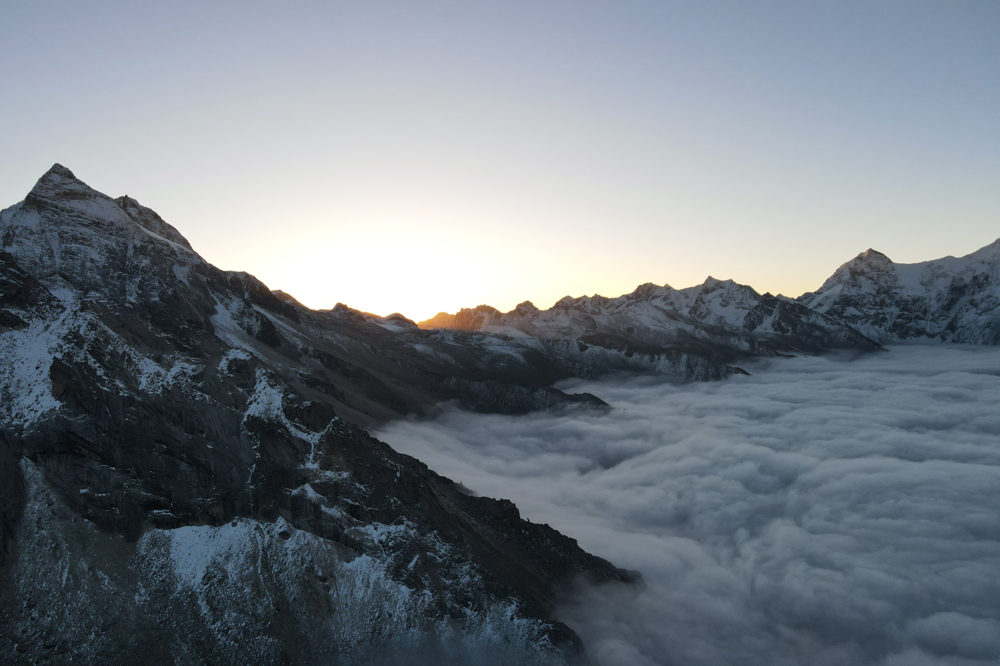
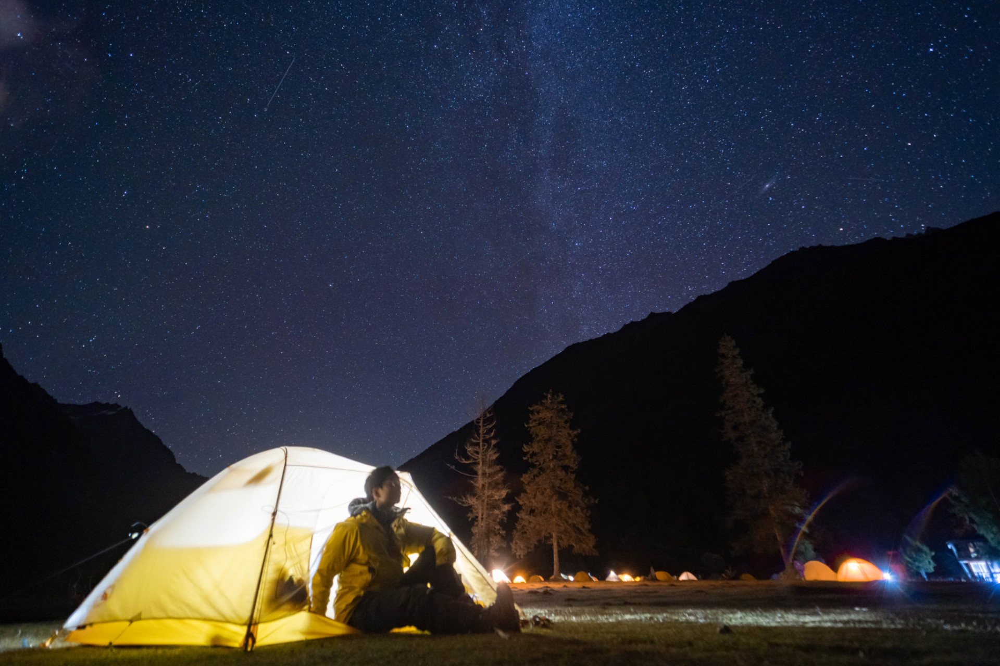
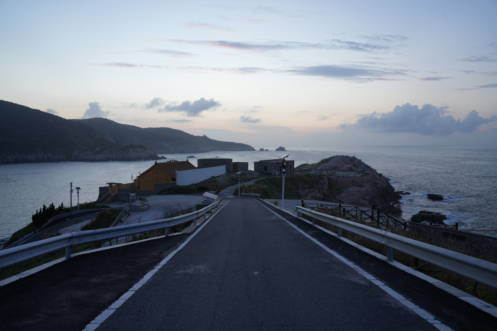

## Misc

I am a landscape photographer with more than 5 years of photography experience. I've traveled to many places with my Sony A7M4 and recorded the beauty of plateaus, snow-capped mountains, and starry skies. I occasionally post some videos on my [Bilibili](https://space.bilibili.com/18636556) account and welcome your attention.

**2022.10.18** I climbed over the mountain valley at an altitude of 4650m. The drone and I were both above the sea of clouds, waiting for the sunrise.

**2023.10.17** I camped on Siguniang Shan and watched the stars. I saw the Milky Way hanging on Yaomei Peak.

**2022.7.29** This is Flower-and-Bird Island in Zhejiang Province. The island is small but beautiful, just like its name.

