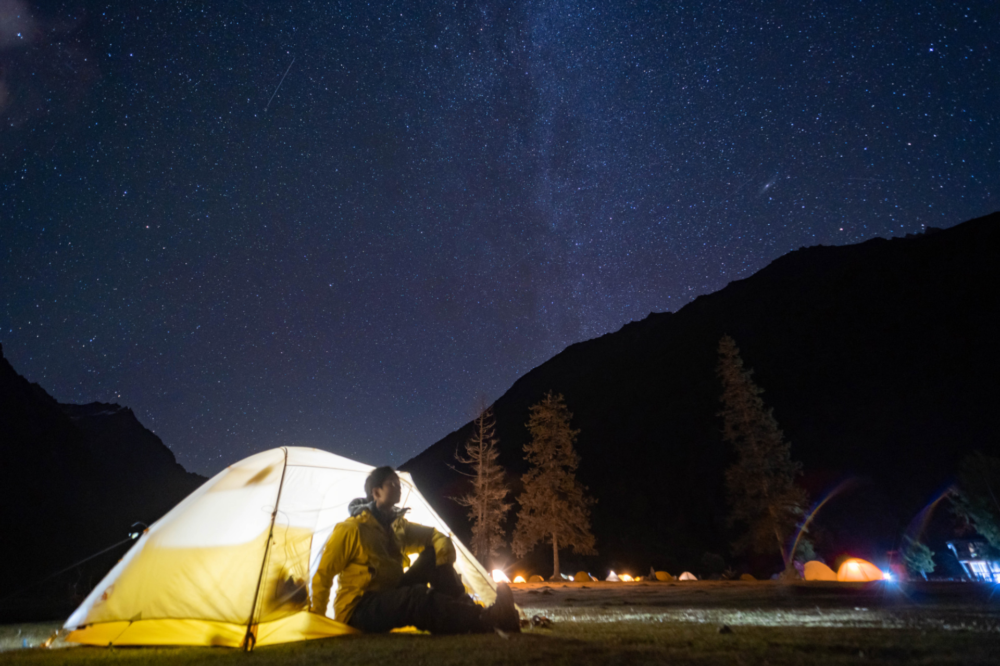

## About Me
- **Bachelor's degree:** [Shanghai Jiao Tong University](https://en.sjtu.edu.cn/), 2018-2022. Major in Computer Science and Engineering (IEEE Pilot Class), Ranking 7/134.
- **Master's degree:** [Shanghai Jiao Tong University](https://en.sjtu.edu.cn/), 2022-2025 (expected). Research in [MediaBrain](https://mediabrain.sjtu.edu.cn/) Lab, supervised by Prof. [Siheng Chen](https://siheng-chen.github.io/). 

## Research Interests

- **Autonomous Driving** 
- **Collaborative Peception** 
- **Efficient Machine Learning**

<!-- ## News

- **[Feb. 2020]** Our paper about incremental learning is accepted to CVPR 2020.
- **[Feb. 2020]** We will host the ACM Multimedia Asia 2020 conference in Singapore!
- **[Sept. 2019]** Our paper about few-shot learning is accepted to NeurIPS 2019.
- **[Mar. 2019]** Our paper about few-shot learning is accepted to CVPR 2019. -->











**2022.10.18** I climbed over the mountain valley at an altitude of 4650m. The drone and I were both above the sea of clouds, waiting for the sunrise.

**2023.10.17** I camped on Siguniang Shan and watched the stars. I saw the Milky Way hanging on Yaomei Peak.

**2022.7.29** This is Flower-and-Bird Island in Zhejiang Province. The island is small but beautiful, just like its name.

 
